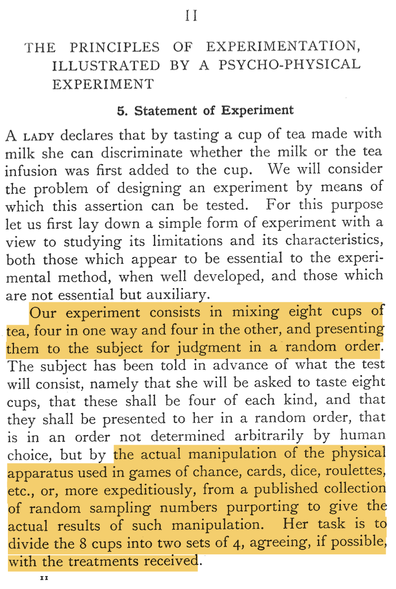

# Randomized experiments

### Randomized experiments

Randomized experiments and causal inference

-   Experiments are conceptually and practically central to causal
    inference

    -   Specifically experiments featuring control groups and random
        assignment

-   In many applications, these experiments are a "methodological ideal"

-   Stats 101 principles: Bias, variance, $p$-values, confidence levels,
    etc.

    -   But without ideas that data sampled from superpopulation or
        probabilistic outcome generating mechanism

    -   At least, those ideas are optional

# Random Assignment

### Example: Fisher's "Lady Tasting Tea"

@fisher1935a [p. 11] describes
"lady tasting tea" experiment as follows:

{width="50%"}

### Random assignment
\fontsize{11pt}{11pt}\selectfont

-   \mh{Treatment Assignment}

-   Denote whether $i$th unit (cup) is assigned to treatment
    (milk-first) or control (tea-first) by $z_i = 1$ or $z_i = 0$

-   Denote collection of all $N$ treatment indicator variables by\
    $\bm{z} = \begin{bmatrix} z_1 & z_2 & \ldots & z_N \end{bmatrix}^{\top}$

-   There are $2^N$ ways one could assign $N$ units to treatment or
    control

\begin{equation*}
\left\{0, 1\right\}^N = \left\{
\begin{bmatrix} 0 \\ 0 \\ 0 \\ 0 \\ 0 \\ 0 \\ 0 \\ 0 \end{bmatrix},
\begin{bmatrix} 1 \\ 0 \\ 0 \\ 0 \\ 0 \\ 0 \\ 0 \\ 0 \end{bmatrix},
\begin{bmatrix} 0 \\ 1 \\ 0 \\ 0 \\ 0 \\ 0 \\ 0 \\ 0 \end{bmatrix},
\cdots ,
\begin{bmatrix} 1 \\ 0 \\ 1 \\ 1 \\ 1 \\ 1 \\ 1 \\ 1 \end{bmatrix},
\begin{bmatrix} 0 \\ 1 \\ 1 \\ 1 \\ 1 \\ 1 \\ 1 \\ 1 \end{bmatrix},
\begin{bmatrix} 1 \\ 1 \\ 1 \\ 1 \\ 1 \\ 1 \\ 1 \\ 1 \end{bmatrix}
\right\}
\end{equation*}

### Random assignment

-   For our purposes, a randomized design is a procedure for selecting
    any assignment from $\left\{0, 1\right\}^N$ with probability
    $p(\bm{z})$

-   Therefore, $\bm{Z}$ is a random vector with support
    $\Omega \coloneqq \left\{\bm{z}: p(\bm{z}) > 0\right\}$ and
    $\Pr\left(\bm{Z} = \bm{z}\right) = p(\bm{z})$

-   \mh{Bernoulli (simple random) assignment}

    -   $N$ independent flips of (usually fair) coin

-   \mh{Complete random assignment}

    -   $N$ draws from an urn in which some proportion are red (treated)
        balls and remaining proportion are blue (control) balls

### Random assignment

-   @fisher1935a [p. 11]:

    > "Our experiment consists in mixing eight cups of tea, four in one
    > way and four in the other, and presenting them to the subject for
    > judgment in a random order."

    -   Support of $\bm{Z}$ is
        $$\left\{0, 1\right\}^N \supset \Omega = \left\{
        \begin{bmatrix} 1 \\ 1 \\ 1 \\ 1 \\ 0 \\ 0 \\ 0 \\ 0 \end{bmatrix},
        \begin{bmatrix} 1 \\ 1 \\ 1 \\ 0 \\ 1 \\ 0 \\ 0 \\ 0 \end{bmatrix},
        \begin{bmatrix} 1 \\ 1 \\ 1 \\ 0 \\ 0 \\ 1 \\ 0 \\ 0 \end{bmatrix},
        \cdots ,
        \begin{bmatrix} 0 \\ 0 \\ 0 \\ 1 \\ 1 \\ 0 \\ 1 \\ 1 \end{bmatrix},
        \begin{bmatrix} 0 \\ 0 \\ 0 \\ 1 \\ 0 \\ 1 \\ 1 \\ 1 \end{bmatrix},
        \begin{bmatrix} 0 \\ 0 \\ 0 \\ 0 \\ 1 \\ 1 \\ 1 \\ 1 \end{bmatrix}
        \right\}$$

    -   Probability of each assignment in $\Omega$ is
        $\Pr\left(\mathbf{Z} = \mathbf{z} \right) = \left\lvert \Omega \right\rvert^{-1}$
        for all $\bm{z} \in \Omega$

    -   ($\left\lvert \Omega \right\rvert$ is the cardinality of, i.e.,
        number of elements in, the set $\Omega$)

### Randomization-based distributions
\fontsize{10pt}{10pt}\selectfont

-   Suppose first of $70$ assignments happened to be randomly selected

-   The "lady" correctly identifies all $4$ milk-first and all $4$
    tea-first cups

\vspace{1em}
\begin{table}[H]
\centering
\begin{tabular}{l|cc}
\toprule
Unit & $\bm{z}$ & $\bm{y}$ \\ 
  \midrule
$1$ & $1$ & $1$  \\ 
$2$ & $1$ & $1$  \\ 
$3$ & $1$ & $1$  \\ 
$4$ & $1$ & $1$  \\ 
$5$ & $0$ & $0$  \\ 
$6$ & $0$ & $0$  \\ 
$7$ & $0$ & $0$ \\ 
$8$ & $0$ & $0$ 
\end{tabular}
\caption{Results of R. A. Fisher's ``Lady Tasting Tea'' experiment}
\label{tab: lady tasting tea obs data}
\end{table}

-   We summarize data by number of focal-group (milk-first) cups
    correctly identified, $\mathbf{z}^{\top}\mathbf{y}$, which in this
    case is $\mathbf{z}^{\top}\mathbf{y} = 4$

### Randomization-based distributions

-   @fisher1935a entertained \mh{counter-to-fact assignments of
    treatment}, holding responses fixed at their
    observed values

-   Responses fixed at observed values corresponds to scenario in which
    "lady" cannot discriminate between milk-first and tea-first cups

\vfill
\begin{table}[H]
\scriptsize
    \begin{tabular}{l|l}
    \toprule
    $\mathbf{z}_1$ & $\mathbf{y}$ \\ \midrule
    1 & 1  \\
    1 & 1   \\
    1 & 1   \\
    1 & 1  \\
    0 & 0  \\
    0 & 0  \\
    0 & 0  \\
    0 & 0  
    \end{tabular}
    \hfill
      \begin{tabular}{l|l}
      \toprule
    $\mathbf{z}_2$ & $\mathbf{y}$ \\ \midrule
    1 &  1  \\
    1 &  1  \\
    1 &  1  \\
    0 &  1   \\
    1 &  0  \\
    0 &  0  \\
    0 &  0  \\
    0 &  0  
    \end{tabular}
     \hfill
      \begin{tabular}{l|l}
      \toprule
    $\mathbf{z}_3$ & $\mathbf{y}$ \\ \midrule
    1 & 1  \\
    1 & 1  \\
    1 & 1  \\
    0 & 1   \\
    0 & 0  \\
    1 & 0  \\
    0 & 0  \\
    0 & 0  
    \end{tabular}
     \hfill
     $\cdots $
     \hfill
      \begin{tabular}{l|l}
      \toprule
    $\mathbf{z}_{68}$ & $\mathbf{y}$ \\ \midrule
    0 & 1  \\
    0 & 1  \\
    0 & 1  \\
    1 & 1   \\
    1 & 0  \\
    0 & 0  \\
    1 & 0  \\
    1 & 0  
    \end{tabular}
     \hfill
      \begin{tabular}{l|l}
      \toprule
    $\mathbf{z}_{69}$ & $\mathbf{y}$ \\ \midrule
    0 & 1  \\
    0 & 1  \\
    0 & 1  \\
    1 & 1  \\
    0 & 0 \\
    1 & 0  \\
    1 & 0  \\
    1 & 0  
    \end{tabular}
     \hfill
      \begin{tabular}{l|l}
      \toprule
    $\mathbf{z}_{70}$ & $\mathbf{y}$ \\ \midrule
    0 & 1  \\
    0 & 1  \\
    0 & 1  \\
    0 & 1  \\
    1 & 0   \\
    1 & 0  \\
    1 & 0  \\
    1 & 0  
    \end{tabular}
\label{tab: fisher's null pot outs schedule}
\end{table}

### Randomization-based distributions

-   @fisher1935a derived distribution of summary measure,
    $\bm{Z}^{\top} \bm{y}$, if "lady" could not discriminate between
    milk-first and tea-first cups

{width="90%"}

# Potential Outcomes

### Potential outcomes

-   Thus far, we have entertained counter-to-fact assignments of
    treatment

    -   Responses have been fixed at their observed values

-   @neyman1923 and @rubin1974 also posited counter-to-fact outcomes

    -   I.e., [potential outcomes]{style="color: magenta"}

-   E.g., perfect discrimination in "Lady Tasting Tea" example

\vfill
\begin{table}[H]
\scriptsize
    \begin{tabular}{l|l}
    \toprule
    $\mathbf{z}_1$ & $\mathbf{y}$ \\ \midrule
    1 & 1  \\
    1 & 1   \\
    1 & 1   \\
    1 & 1  \\
    0 & 0  \\
    0 & 0  \\
    0 & 0  \\
    0 & 0  
    \end{tabular}
    \hfill
      \begin{tabular}{l|l}
      \toprule
    $\mathbf{z}_2$ & $\mathbf{y}$ \\ \midrule
    1 &  1  \\
    1 &  1  \\
    1 &  1  \\
    0 &  0   \\
    1 &  1  \\
    0 &  0  \\
    0 &  0  \\
    0 &  0  
    \end{tabular}
     \hfill
      \begin{tabular}{l|l}
      \toprule
    $\mathbf{z}_3$ & $\mathbf{y}$ \\ \midrule
    1 & 1  \\
    1 & 1  \\
    1 & 1  \\
    0 & 0   \\
    0 & 0  \\
    1 & 1  \\
    0 & 0  \\
    0 & 0  
    \end{tabular}
     \hfill
     $\cdots $
     \hfill
      \begin{tabular}{l|l}
      \toprule
    $\mathbf{z}_{68}$ & $\mathbf{y}$ \\ \midrule
    0 & 0  \\
    0 & 0  \\
    0 & 0  \\
    1 & 1   \\
    1 & 1  \\
    0 & 0  \\
    1 & 1  \\
    1 & 1  
    \end{tabular}
     \hfill
      \begin{tabular}{l|l}
      \toprule
    $\mathbf{z}_{69}$ & $\mathbf{y}$ \\ \midrule
    0 & 0  \\
    0 & 0  \\
    0 & 0  \\
    1 & 1  \\
    0 & 0 \\
    1 & 1  \\
    1 & 1  \\
    1 & 1  
    \end{tabular}
     \hfill
      \begin{tabular}{l|l}
      \toprule
    $\mathbf{z}_{70}$ & $\mathbf{y}$ \\ \midrule
    0 & 0  \\
    0 & 0  \\
    0 & 0  \\
    0 & 0  \\
    1 & 1   \\
    1 & 1  \\
    1 & 1  \\
    1 & 1  
    \end{tabular}
\end{table} \vfill

### Potential outcomes

{width="100%"}

### Potential outcomes

-   A \mh{potential outcome schedule} is vector-valued function
    $\bm{y}: \left\{0, 1\right\}^N \mapsto \mathop{\mathrm{\mathbb{R}}}^N$

    -   Potential outcomes for all $N$ units written as $\bm{y}(\bm{z})$

    -   Potential outcome for individual unit $i$ written as
        $y_i(\bm{z})$

-   Intuitively, a listing of how each unit would respond to any
    $\bm{z} \in \left\{0, 1\right\}^N$

-   We often consider potential outcome schedules that satisfy Stable
    Unit Treatment Value Assumption (SUTVA)
    [@cox1958a; @rubin1980b; @rubin1986]

-   SUTVA means that

    1.  Units in experiment respond to only treatment condition to which
        each unit is individually assigned

    2.  Treatment condition is actually the same treatment for all units
        assigned to treatment and control condition is the same for all
        units assigned to control

### Potential outcomes

-   SUTVA implies

    -   One fixed value of the outcome for unit $i$ if it is assigned to
        treatment $(z_i = 1)$ and another fixed value if unit $i$ is
        assigned to control $(z_i = 0)$

    -   $\rightarrow$ write potential outcomes for unit $i$ as $y_i(1)$
        or $y_i(0)$

    -   Each unit has at most two potential outcomes

### Potential outcomes
\fontsize{8pt}{8pt}\selectfont

-   Both no discrimination and perfect discrimination satisfy SUTVA

-   Consider, e.g., unit $i = 4$ under each potential outcome schedule

\begin{center}\textbf{No discrimination}\end{center}

\begin{table}[H]
    \begin{tabular}{l|l}
    $\mathbf{z}_1$ & $\mathbf{y}$ \\ \midrule
    1 & 1  \\
    1 & 1   \\
    1 & 1   \\
    \mh{1} & \mh{1}  \\
    0 & 0  \\
    0 & 0  \\
    0 & 0  \\
    0 & 0  
    \end{tabular}
    \hfill
      \begin{tabular}{l|l}
    $\mathbf{z}_2$ & $\mathbf{y}$ \\ \midrule
    1 &  1  \\
    1 &  1  \\
    1 &  1  \\
    \mh{0} &  \mh{1}   \\
    1 &  0  \\
    0 &  0  \\
    0 &  0  \\
    0 &  0  
    \end{tabular}
     \hfill
      \begin{tabular}{l|l}
    $\mathbf{z}_3$ & $\mathbf{y}$ \\ \midrule
    1 & 1  \\
    1 & 1  \\
    1 & 1  \\
    \mh{0} & \mh{1}   \\
    0 & 0  \\
    1 & 0  \\
    0 & 0  \\
    0 & 0  
    \end{tabular}
     \hfill
     $\cdots $
     \hfill
      \begin{tabular}{l|l}
    $\mathbf{z}_{68}$ & $\mathbf{y}$ \\ \midrule
    0 & 1  \\
    0 & 1  \\
    0 & 1  \\
    \mh{1} & \mh{1}   \\
    1 & 0  \\
    0 & 0  \\
    1 & 0  \\
    1 & 0  
    \end{tabular}
     \hfill
      \begin{tabular}{l|l}
    $\mathbf{z}_{69}$ & $\mathbf{y}$ \\ \midrule
    0 & 1  \\
    0 & 1  \\
    0 & 1  \\
    \mh{1} & \mh{1}  \\
    0 & 0 \\
    1 & 0  \\
    1 & 0  \\
    1 & 0  
    \end{tabular}
     \hfill
      \begin{tabular}{l|l}
    $\mathbf{z}_{70}$ & $\mathbf{y}$ \\ \midrule
    0 & 1  \\
    0 & 1  \\
    0 & 1  \\
    \mh{0} & \mh{1}  \\
    1 & 0   \\
    1 & 0  \\
    1 & 0  \\
    1 & 0  
    \end{tabular}
\end{table} \vfill
\vspace{1em}

\begin{center}\textbf{Perfect discrimination}\end{center}

\begin{table}[H]
    \begin{tabular}{l|l}
    $\mathbf{z}_1$ & $\mathbf{y}$ \\ \midrule
    1 & 1  \\
    1 & 1   \\
    1 & 1   \\
    \mh{1} & \mh{1}  \\
    0 & 0  \\
    0 & 0  \\
    0 & 0  \\
    0 & 0  
    \end{tabular}
    \hfill
      \begin{tabular}{l|l}
    $\mathbf{z}_2$ & $\mathbf{y}$ \\ \midrule
    1 &  1  \\ 
    1 &  1  \\
    1 &  1  \\
    \mh{0} &  \mh{0}   \\
    1 &  1  \\
    0 &  0  \\
    0 &  0  \\
    0 &  0  
    \end{tabular}
     \hfill
      \begin{tabular}{l|l}
    $\mathbf{z}_3$ & $\mathbf{y}$ \\ \midrule
    1 & 1  \\
    1 & 1  \\
    1 & 1  \\
    \mh{0} & \mh{0}   \\
    0 & 0  \\
    1 & 1  \\
    0 & 0  \\
    0 & 0  
    \end{tabular}
     \hfill
     $\cdots$
     \hfill
      \begin{tabular}{l|l}
    $\mathbf{z}_{68}$ & $\mathbf{y}$ \\ \midrule
    0 & 0  \\
    0 & 0  \\
    0 & 0  \\
    \mh{1} & \mh{1}   \\
    1 & 1  \\
    0 & 0  \\
    1 & 1  \\
    1 & 1  
    \end{tabular}
     \hfill
      \begin{tabular}{l|l}
    $\mathbf{z}_{69}$ & $\mathbf{y}$ \\ \midrule
    0 & 0  \\
    0 & 0  \\
    0 & 0  \\
    \mh{1} & \mh{1}  \\
    0 & 0 \\
    1 & 1  \\
    1 & 1  \\
    1 & 1  
    \end{tabular}
     \hfill
      \begin{tabular}{l|l}
    $\mathbf{z}_{70}$ & $\mathbf{y}$ \\ \midrule
    0 & 0  \\
    0 & 0  \\
    0 & 0  \\
    \mh{0} & \mh{0}  \\
    1 & 1   \\
    1 & 1  \\
    1 & 1  \\
    1 & 1  
    \end{tabular}
\end{table}

### Potential outcomes

-   \mh{Fundamental Problem of Causal Inference} [@holland1986]

    ::: center
    We can never observe both $y_{i}(1)$ and $y_{i}(0)$ for the same
    $i$\
    :::

-   We can observe only one of the two potential outcomes
    $$y_i = z_i y_{i}(1) + (1 - z_i)y_{i}(0)$$

-   Analogue without supposing SUTVA

    -   We can observe $y_i(\bm{z})$ under only one
        $\bm{z} \in \left\{0, 1\right\}^N$

# Next class: Hypothesis testing

### Hypothesis testing

-   Use known assignment mechanism to [reliably]{style="color: magenta"}
    gather evidence

    -   against null hypothesis about one potential outcome schedule\
        (e.g., no discrimination)

    -   and in favor of alternative hypothesis about another\
        (e.g., perfect discrimination)

### References

\fontsize{8pt}{8pt}\selectfont

