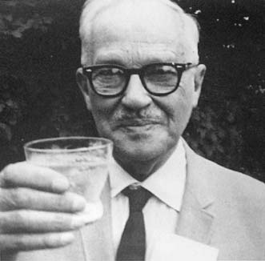

# Difference-in-Means estimator

### Review: setup for randomized experiments
\fontsize{12pt}{11pt}\selectfont

-   Units: $i = 1, \ldots, N$

-   Treatment: $Z_i = 0$ or $Z_i = 1$ is randomly assigned

-   Potential outcomes: $y_i(0)$ and $y_i(1)$

-   Observed outcome: $Y_i = Z_i y_i(1) + (1 - Z_i) y_i(0)$

-   Treatment Assignment Mechanism

-   \(1\) \mh{Bernoulli (simple) randomization}: Each unit is independently assigned to treatment with
    probability $p$

-   \(2\) \mh{Complete randomization}: Exactly $n_1$ units are treated and $N - n_1 = n_0$ units
    are untreated

-   \(3\) In practice, we can treat (1)'s as (2)'s, by
    conditioning on $\{\sum_{i=1}^{N} Z_i = \sum_{i=1}^{N} z_i\}$ (fixing $n_1$ at its observed value)

-   Under complete or simple (conditioning on observed $n_1$)
    randomization
    $$\mathop{\mathrm{\rm{E}}}\left[Z_i\right] = \dfrac{n_1}{N}$$

-   Today's discussion (& Neyman-type c.i. in general) assumes no interference. 

### Jerzy Neyman (b. 1891, Moldova; d. 1981, California)
\fontsize{11pt}{11pt}\selectfont

:::::: {.columns}
::: {.column width="30%"}
```{asis, echo=!handout_}

```
:::
::: {.column width="70%"}
"Neyman and Fisher disagreed vehemently.... Neyman was also the opposite to Fisher in his political viewpoints.... He was fiercely against discrimination.... In 1941 at UC Berkeley he hired women... In 1942, Neyman examined the possibility of hiring David Blackwell, a Black statistician....
:::
::::::

> He is able to get Blackwell to Berkeley in 1953 as a visiting professor, and offers him a tenured job in 1954, making David Blackwell the first tenured faculty member....
\pause 
> He wrote a letter to his friend Harald Cramér that \mh{he believed Martin Luther King, Jr. deserved a Nobel Peace Prize} (which Cramér forwarded to the chairman of the Nobel Committee, and which he believed \mh{might have contributed} [to King's winning the prize])" (D. Lakens, 2021)

\note{(From Daniel Lakens blog post of Sept 20, 2021, ``Jerzy Neyman: A Positive Role Model in the History of Frequentist Statistics.''}

## (Un)bias of Difference-in-Means in simply randomized designs 

###  Unbiasedness of Difference-in-Means: Proof
\fontsize{10pt}{10pt}\selectfont

-  \mh{Difference-in-Means estimator} $$\begin{aligned}
          \hat{\tau}\left(\bm{Z}, \bm{Y}\right) & = n_1^{-1} \bm{Z}^{\top} \bm{Y} - n_0^{-1} \left(\bm{1} - \bm{Z}\right)^{\top}\bm{Y} \\ 
          & = \frac{1}{n_1} \sum_{i=1}^N Z_i Y_i - \frac{1}{n_0} \sum_{i = 1}^N (1 - Z_i) Y_i
    \end{aligned}$$

-   \mh{Unbiased} for the ATE under complete randomization \pause

-   $$\begin{aligned}
            \hspace{-0.4in} \mathop{\mathrm{\rm{E}}}\left[\hat{\tau}\left(\bm{Z}, \bm{Y}\right)\right] & = \mathop{\mathrm{\rm{E}}}\left[\frac{1}{n_1} \sum_{i=1}^N Z_i Y_i - \frac{1}{n_0} \sum_{i = 1}^N (1 - Z_i) Y_i\right]\\
            \hspace{-0.4in} & =  \frac{1}{n_1} \sum_{i=1}^N \mathop{\mathrm{\rm{E}}}\left[Z_i Y_i\right]
                                  - \frac{1}{n_0} \sum_{i=1}^N \mathop{\mathrm{\rm{E}}}\left[(1 - Z_i) Y_i\right] \hspace{0.1in}
                                  \mbox{($\because$ Linearity of $\mathop{\mathrm{\rm{E}}}$)}\\ 
            \hspace{-0.4in} & =  \frac{1}{n_1} \sum_{i=1}^N \mathop{\mathrm{\rm{E}}}\left[Z_i y_i(1)\right]
                                  - \frac{1}{n_0} \sum_{i=1}^N \mathop{\mathrm{\rm{E}}}\left[(1 - Z_i) y_i(0) \right] \hspace{0.1in}
                                  \mbox{($\because$ Definition of POs)}\\ 
            \hspace{-0.4in} & =  \frac{1}{n_1} \sum_{i=1}^N y_i(1) \mathop{\mathrm{\rm{E}}}\left[Z_i\right]
                                  - \frac{1}{n_0} \sum_{i=1}^N y_i(0) \mathop{\mathrm{\rm{E}}}\left[1 - Z_i\right] \hspace{0.1in}
                                  \mbox{($\because$ POs are fixed)}\\ 
             \hspace{-0.4in} & =  \frac{1}{n_1} \sum_{i=1}^N y_i(1) \left(\frac{n_1}{N}\right)
                                  - \frac{1}{n_0} \sum_{i=1}^N y_i(0) \left(\frac{n_0}{N}\right) \hspace{0.1in}
                                  \mbox{($\because$ complete randomization)}\\ 
              \hspace{-0.4in} & =  \frac{1}{N} \sum_{i=1}^N y_i(1)
                                  - \frac{1}{N} \sum_{i=1}^N y_i(0)
    \end{aligned}$$


###  Unbiasedness of Difference-in-Means: Example

::::::{.columns}
:::{.column width="47%"}
  $\bm{z}_1$   $\bm{y}(\bm{0})$   $\bm{y}(\bm{1})$   $\bm{y}_1$
  ------------ ------------------ ------------------ ------------
  1            ?                  15                 15
  1            ?                  15                 15
  0            20                 ?                  20
  0            20                 ?                  20
  0            10                 ?                  10
  0            15                 ?                  15
  0            15                 ?                  15
:::
::: {.column width="6%"}
\vspace{.35\textheight}
\ldots
:::
::: {.column width="47\%"}
  $\bm{z}_{21}$   $\bm{y}(\bm{0})$   $\bm{y}(\bm{1})$   $\bm{y}_{21}$
  --------------- ------------------ ------------------ ---------------
  0               10                 ?                  10
  0               15                 ?                  15
  0               20                 ?                  20
  0               20                 ?                  20
  0               10                 ?                  10
  1               ?                  15                 15
  1               ?                  30                 30
:::
::::::

-   Random vectors $\bm{Z}$ and $\bm{Y}$ can take on any
    $\left(\bm{z}_1, \bm{y}_1\right), \cdots , \left(\bm{z}_{21}, \bm{y}_{21}\right)$

-   Applying Diff-in-Means estimator to all $21$ possible realizations
    of data $\implies$ $21$ estimates:
    $\hat{\tau}\left(\bm{z}_1, \bm{y}_1\right) = -1$, $\hat{\tau}\left(\bm{z}_2, \bm{y}_2\right) = 7.5$,\ldots $\hat{\tau}\left(\bm{z}_{21}, \bm{y}_{21}\right) = 7.5$.

### Example cont'd

-   Expected value of Diff-in-Means estimator:
    $$\mathop{\mathrm{\rm{E}}}\left[\hat{\tau}\left(\bm{Z}, \bm{Y}\right)\right] = \hat{\tau}\left(\bm{z}_1, \bm{y}_1\right)\Pr\left(\bm{Z} = \bm{z}_1\right) + \ldots + \hat{\tau}\left(\bm{z}_{21}, \bm{y}_{21}\right)\Pr\left(\bm{Z} = \bm{z}_{21}\right)$$

-   So, in "village heads" example
    $$\mathop{\mathrm{\rm{E}}}\left[\hat{\tau}\left(\bm{Z}, \bm{Y}\right)\right] = (-1) \left(1/21\right) + (7.5) \left(1/21\right) + \ldots + (7.5) \left(1/21\right) = 5$$
    Which happens to be the ACE, $\frac{1}{7}\sum_{i=1}^7 [y_i(1) - y_i(0)]$.

###  Unbiasedness of Difference-in-Means: Example

-   Diff-in-Means estimator under complete random assignment

-   {width="\\linewidth"}

###  Next steps

-   What happens when the size of our experiment grows large?

-   Consistency of Difference-in-Means estimator for ATE

-   Asymptotic validity of hypothesis tests about ATE


## Variance of Difference-in-Means

### Variance of Difference-in-Means estimator {.build}

-   Variance is average squared distance of estimator from its expected
    value:
    $$\underbrace{\mathop{\mathrm{\rm{E}}}\left[\underbrace{\left(\hat{\tau}\left(\bm{Z}, \bm{Y}\right) - \underbrace{\mathop{\mathrm{\rm{E}}}\left[\hat{\tau}\left(\bm{Z}, \bm{Y}\right)\right]}_{\color{red}{\text{Expected value}}}\right)^2}_{\color{blue}{\text{Squared distance from expected value}}}\right]}_{\color{green}{\text{Average (or expected) squared distance}}}$$

-   Diff-in-Means unbiased for $\tau$, so write variance as
    $$\mathop{\mathrm{\rm{E}}}\left[\left(\hat{\tau}\left(\bm{Z}, \bm{Y}\right) - \tau\right)^2\right]$$

-   In "village heads" example with 21 possible assignments
    $$\begin{aligned}
    \left(\hat{\tau}\left(\bm{z}_1, \bm{y}_1\right) - \tau\right)^2 \Pr\left(\bm{Z} = \bm{z}_1\right) + \ldots + \left(\hat{\tau}\left(\bm{z}_{21}, \bm{y}_{21}\right) - \tau\right)^2 \Pr\left(\bm{Z} = \bm{z}_{21}\right)
    \end{aligned}$$

-   Variance is $\approx 21.19$

::: frame
### Variance of Difference-in-Means estimator

-   Neyman (1923) derived expression for variance of Diff-in-Means under
    complete random assignment
    $$\mathop{\mathrm{\rm{Var}}}\left[\hat{\tau}\left(\bm{Z}, \bm{Y}\right)\right] = \frac{1}{N - 1}\left(\frac{n_1 {\color{magenta}{\sigma^2_{\bm{y}(\bm{0})}}}}{n_0} + \frac{n_0 {\color{magenta}{\sigma^2_{\bm{y}(\bm{1})}}}}{n_1} + 2{\color{magenta}{\sigma_{\bm{y}(\bm{0}), \bm{y}(\bm{1})}}}\right)$$
    where

-   $\sigma^2_{\bm{y}(\bm{0})} = \frac{1}{N} \sum \limits_{i = 1}^N \left(y_i(0) - \frac{1}{N} \sum \limits_{i = 1}^N y_i(0)\right)^2$
    is var of control POs

-   $\sigma^2_{\bm{y}(\bm{1})} = \frac{1}{N} \sum \limits_{i = 1}^N \left(y_i(1) - \frac{1}{N} \sum \limits_{i = 1}^N y_i(1)\right)^2$
    is var of treated POs

-   $\sigma_{\bm{y}(\bm{0}), \bm{y}(\bm{1})} = \frac{1}{N} \sum \limits_{i = 1}^N \left(y_i(0) - \frac{1}{N} \sum \limits_{i = 1}^N y_i(0)\right)\left(y_i(1) - \frac{1}{N} \sum \limits_{i = 1}^N y_i(1)\right)$
    is cov of POs

$\star$ Note that ${\color{magenta}{\sigma^2_{\bm{y}(\bm{0})}}}$,
${\color{magenta}{\sigma^2_{\bm{y}(\bm{1})}}}$ and
${\color{magenta}{\sigma_{\bm{y}(\bm{0}), \bm{y}(\bm{1})}}}$ depend on
unknown potential outcomes
:::

::: frame
### Variance of Difference-in-Means estimator

-   Sometimes you might see equivalent expression (Imbens and
    Rubin 2015)
    $$\dfrac{{\color{magenta}{S_{\bm{y}(\bm{0})}}}}{n_0} + \dfrac{{\color{magenta}{S_{\bm{y}(\bm{1})}}}}{n_1} - \dfrac{{\color{magenta}{S_{\tau}}}}{N},$$
    where

-   $S_{\bm{y}(\bm{0})} = \frac{1}{N - 1} \sum \limits_{i = 1}^N \left(y_i(0) - \frac{1}{N} \sum \limits_{i = 1}^N y_i(0)\right)^2$

-   $S_{\bm{y}(\bm{1})} = \frac{1}{N - 1} \sum \limits_{i = 1}^N \left(y_i(1) - \frac{1}{N} \sum \limits_{i = 1}^N y_i(1)\right)^2$

-   $S_{\tau} = \frac{1}{N - 1} \sum \limits_{i = 1}^N \left(\tau_i - \frac{1}{N} \sum \limits_{i = 1}^N \tau_i\right)^2$

\pause$\star$ Note that ${\color{magenta}{S_{\bm{y}(\bm{0})}}}$,
${\color{magenta}{S_{\bm{y}(\bm{1})}}}$ and
${\color{magenta}{S_{\tau}}}$ depend on unknown potential outcomes
:::

::: frame
### Variance of Difference-in-Means estimator
\fontsize{10pt}{10pt}\selectfont

-   Example: "Village heads" study (Gerber & Green 2012, Ch. 2):

-   ::: center
      --------- ----------------------- ----------------------- -------------
                       Budget share (%)                         
      Village     $\bm{\bm{y}(\bm{0})}$   $\bm{\bm{y}(\bm{1})}$   $\bm{\tau}$
      1                              10                      15             5
      2                              15                      15             0
      3                              20                      30            10
      4                              20                      15            -5
      5                              10                      20            10
      6                              15                      15             0
      7                              15                      30            15
      Average                        15                      20             5
      --------- ----------------------- ----------------------- -------------
    :::

-   With access to true POs, we can directly calculate
    $\mathop{\mathrm{\rm{Var}}}\left[\hat{\tau}\left(\bm{Z}, \bm{Y}\right)\right]$:
    ${\color{magenta}{\sigma^2_{\bm{y}(\bm{0})}}} \approx 14.29$,
    ${\color{magenta}{\sigma^2_{\bm{y}(\bm{1})}}} \approx 42.86$,
    ${\color{magenta}{\sigma_{\bm{y}(\bm{0}), \bm{y}(\bm{1})}}} \approx 7.14$\pause

-   So,
    $\mathop{\mathrm{\rm{Var}}}\left[\hat{\tau}\left(\bm{Z}, \bm{Y}\right)\right] = \frac{1}{N - 1}\bigg(\frac{n_1 {\color{magenta}{\sigma^2_{\bm{y}(\bm{0})}}}}{n_0} + \frac{n_0 {\color{magenta}{\sigma^2_{\bm{y}(\bm{1})}}}}{n_1} + 2{\color{magenta}{\sigma_{\bm{y}(\bm{0}), \bm{y}(\bm{1})}}}\bigg) \approx 21.19$\pause

-   In practice, ${\color{magenta}{\sigma^2_{\bm{y}(\bm{0})}}}$,
    ${\color{magenta}{\sigma^2_{\bm{y}(\bm{1})}}}$ and
    ${\color{magenta}{\sigma_{\bm{y}(\bm{0}), \bm{y}(\bm{1})}}}$
    unknown, so we estimate
    $\mathop{\mathrm{\rm{Var}}}\left[\hat{\tau}\left(\bm{Z}, \bm{Y}\right)\right]$
:::

## Variance estimation

::: frame
### Variance estimation
\fontsize{10pt}{10pt}\selectfont
We showed that the Diference-in-Means estimator's
variance is
$$\mathop{\mathrm{\rm{Var}}}\left[\hat{\tau}\left(\bm{Z}, \bm{Y}\right)\right] = \frac{1}{N - 1}\left(\frac{n_1 {\color{blue}{\sigma^2_{\bm{y}(\bm{0})}}}}{n_0} + \frac{n_0 {\color{blue}{\sigma^2_{\bm{y}(\bm{1})}}}}{n_1} + 2{\color{magenta}{\sigma_{\bm{y}(\bm{0}), \bm{y}(\bm{1})}}}\right)$$

-   We have unbiased estimators for
    ${\color{blue}{\sigma^2_{\bm{y}(\bm{0})}}}$ and
    ${\color{blue}{\sigma^2_{\bm{y}(\bm{1})}}}$, but not
    ${\color{magenta}{\sigma_{\bm{y}(\bm{0}), \bm{y}(\bm{1})}}}$

-   So what do we do?\pause 

-   We use **conservative** "plug-in" estimator (Neyman 1923)

-   **Conservative** means that
    $$\mathop{\mathrm{\rm{E}}}\left[\widehat{\mathop{\mathrm{\rm{Var}}}}\left[\hat{\tau}\left(\bm{Z}, \bm{Y}\right)\right]\right] \geq \mathop{\mathrm{\rm{Var}}}\left[\hat{\tau}\left(\bm{Z}, \bm{Y}\right)\right]$$\pause

-   When potential outcomes perfectly positively correlated
    $$\mathop{\mathrm{\rm{E}}}\left[\widehat{\mathop{\mathrm{\rm{Var}}}}\left[\hat{\tau}\left(\bm{Z}, \bm{Y}\right)\right]\right] = \mathop{\mathrm{\rm{Var}}}\left[\hat{\tau}\left(\bm{Z}, \bm{Y}\right)\right]$$

-   Otherwise,
    $\widehat{\mathop{\mathrm{\rm{Var}}}}\left[\hat{\tau}\left(\bm{Z}, \bm{Y}\right)\right]$
    is positively biased (conservative)\pause

-   Potential outcomes will be perfectly positively correlated if and
    only if\
    $\tau_i$ is the same for all $i = 1, \ldots , N$ units
:::

::: frame
### Conservative variance estimator
\fontsize{11pt}{11pt}\selectfont

$$\mathop{\mathrm{\rm{Var}}}\left[\hat{\tau}\left(\bm{Z}, \bm{Y}\right)\right] = \frac{1}{N - 1}\left(\frac{n_1 {\color{blue}{\sigma^2_{\bm{y}(\bm{0})}}}}{n_0} + \frac{n_0 {\color{blue}{\sigma^2_{\bm{y}(\bm{1})}}}}{n_1} + 2{\color{magenta}{\sigma_{\bm{y}(\bm{0}), \bm{y}(\bm{1})}}}\right)$$

-   The maximum possible value of
    $2{\color{magenta}{\sigma_{\bm{y}(\bm{0}), \bm{y}(\bm{1})}}}$ is
    ${\color{blue}{\sigma^2_{\bm{y}(\bm{0})}}} + {\color{blue}{\sigma^2_{\bm{y}(\bm{1})}}}$\pause

-   So substitute
    ${\color{blue}{\sigma^2_{\bm{y}(\bm{0})}}} + {\color{blue}{\sigma^2_{\bm{y}(\bm{1})}}}$
    for $2{\color{magenta}{\sigma_{\bm{y}(\bm{0}), \bm{y}(\bm{1})}}}$:
    $$\begin{aligned}
    \mathop{\mathrm{\rm{Var}}}\left[\hat{\tau}\left(\bm{Z}, \bm{Y}\right)\right] & = \frac{1}{N - 1}\left(\frac{n_1 {\color{blue}{\sigma^2_{\bm{y}(\bm{0})}}}}{n_0} + \frac{n_0 {\color{blue}{\sigma^2_{\bm{y}(\bm{1})}}}}{n_1} + \left({\color{blue}{\sigma^2_{\bm{y}(\bm{0})}}} + {\color{blue}{\sigma^2_{\bm{y}(\bm{1})}}}\right)\right) \\
    & = \frac{N}{N - 1}\left(\frac{{\color{blue}{\sigma^2_{\bm{y}(\bm{0})}}}}{n_0} + \frac{{\color{blue}{\sigma^2_{\bm{y}(\bm{1})}}}}{n_1}\right)
    \end{aligned}$$

-   Now all quantities can be estimated!\pause

-   So, just "plug-in" estimators $\hat{\sigma}^2_{\bm{y}(\bm{0})}$ and
    $\hat{\sigma}^2_{\bm{y}(\bm{1})}$ for
    ${\color{blue}{\sigma^2_{\bm{y}(\bm{0})}}}$ and
    ${\color{blue}{\sigma^2_{\bm{y}(\bm{1})}}}$
    $$\widehat{\mathop{\mathrm{\rm{Var}}}}\left[\hat{\tau}\left(\bm{Z}, \bm{Y}\right)\right] = \frac{N}{N - 1}\left(\frac{\hat{\sigma}^2_{\bm{y}(\bm{0})}}{n_0} + \frac{\hat{\sigma}^2_{\bm{y}(\bm{1})}}{n_1} \right)$$
:::

::: frame
### Variance estimation
\fontsize{9pt}{9pt}\selectfont

-   Here is the conservative variance estimator for "village heads":\
    {width="0.8\\linewidth"}

-   **Solid** line is true variance of Diff-in-Means,
    $\mathop{\mathrm{\rm{Var}}}\left[\hat{\tau}\left(\bm{Z}, \bm{Y}\right)\right]$

-   **Dashed** line is expected value of the conservative variance estimator, 
    i.e. $\mathop{\mathrm{\rm{E}}}\left[\widehat{\mathop{\mathrm{\rm{Var}}}}\left[\hat{\tau}\left(\bm{Z}, \bm{Y}\right)\right]\right]$
:::

# Differences of means in large samples

## Asymptotic properties

::: frame
Asymptotics

-   So far, we have derived

    1.  unbiased Difference-in-Means estimator of ATE

    2.  variance of Difference-in-Means estimator

    3.  conservative estimator of Difference-in-Means estimator's
        variance\pause

-   All of these derivations were for a fixed $N$, either small or large

-   Now let's see what happens to our estimator when $N$ grows large,
    $N \to \infty$

-   But first, why do we care?\pause

-   $N$ never goes to $\infty$ in an actual experiment

-   But properties as $N \to \infty$ **approximate** properties with
    fixed, but large $N$
:::

## Consistent estimation

::: frame
### Consistent estimation

-   Difference-in-Means estimator is consistent:
    $$\lim \limits_{N \to \infty} \Pr\left(\left\lvert \hat{\tau}\left(\bm{Z}, \bm{Y}\right) - \tau \right\rvert < \epsilon \right) = 1 \text{ for all } \epsilon > 0$$

-   In words:

    ::: center
    Pick any $\epsilon$ you want, no matter how small. There will be
    some value $N^{*}$ such that, if size of experiment is greater than
    $N^*$, the probability of an estimate within a distance of
    $\epsilon$ from the truth is equal to $1$.
    :::

-   Intuitively, with large experiment, our estimate will be close to
    true ATE!
:::

::: frame
### Consistent estimation

-   "Village heads" example:

    {width="\\linewidth"}
:::

## Hypothesis testing

::: frame
Hypothesis tests of the weak null

-   The finite population CLT tells us that $$\begin{aligned}
    \cfrac{\hat{\tau}\left(\bm{Z}, \bm{Y}\right) - \mathop{\mathrm{\rm{E}}}\left[\hat{\tau}\left(\bm{Z}, \bm{Y}\right)\right]}{\sqrt{\mathop{\mathrm{\rm{Var}}}\left[\hat{\tau}\left(\bm{Z}, \bm{Y}\right)\right]}} & \overset{d}{\to} \mathcal{N}\left(0, 1\right)
    \end{aligned}$$\pause

-   Diff-in-Means is unbiased, so write $$\begin{aligned}
    \cfrac{\hat{\tau}\left(\bm{Z}, \bm{Y}\right) - \tau}{\sqrt{\mathop{\mathrm{\rm{Var}}}\left[\hat{\tau}\left(\bm{Z}, \bm{Y}\right)\right]}} & \overset{d}{\to} \mathcal{N}\left(0, 1\right)
    \end{aligned}$$\pause

-   The CLT is an asymptotic results as $N \to \infty$

-   But we can bound error of Normal approximation for fixed $N$

-   Thus, with experiments of at least moderate size and outcomes that
    aren't too skewed or have extreme outliers, $$\begin{aligned}
    \cfrac{\hat{\tau}\left(\bm{Z}, \bm{Y}\right) - \tau}{\sqrt{\mathop{\mathrm{\rm{Var}}}\left[\hat{\tau}\left(\bm{Z}, \bm{Y}\right)\right]}} & \overset{\text{approx.}}{\sim} \mathcal{N}\left(0, 1\right)
    \end{aligned}$$

-   This justifies use of standard Normal distribution for hyp.
    tests
:::

::: frame
Hypothesis tests of the weak null

-   "Village heads" example:

    {width="\\linewidth"}
:::

::: frame
### Hypothesis tests of the weak null
\fontsize{10pt}{10pt}\selectfont

-   To test null hypothesis relative to alternative $$\begin{aligned}
    H_0: & \tau = \tau_0 \text{ versus either } \\
    H_A: & \tau > \tau_0, \, H_A: \tau < \tau_0 \text{ or } H_A: \left\lvert \tau \right\rvert > \left\lvert \tau_0 \right \rvert
    \end{aligned}$$

-   Calculate upper(u), lower(l) or two-sided(t) p-value as
    $$\begin{aligned}
    p_u & =  1 - \Phi\left(\frac{\hat{\tau}\left(\bm{Z}, \bm{Y}\right) - \tau_0}{\sqrt{\widehat{\mathop{\mathrm{\rm{Var}}}}\left[\hat{\tau}\left(\bm{Z}, \bm{Y}\right)\right]}}\right) \\
    p_l & =  \Phi\left(\frac{\hat{\tau}\left(\bm{Z}, \bm{Y}\right) - \tau_0}{\sqrt{\widehat{\mathop{\mathrm{\rm{Var}}}}\left[\hat{\tau}\left(\bm{Z}, \bm{Y}\right)\right]}}\right) \\
    p_t & = 2\left(1 - \Phi\left(\frac{\left\lvert\hat{\tau}\left(\bm{Z}, \bm{Y}\right) - \tau_0\right\rvert}{\sqrt{\widehat{\mathop{\mathrm{\rm{Var}}}}\left[\hat{\tau}\left(\bm{Z}, \bm{Y}\right)\right]}}\right)\right)
    \end{aligned}$$

-   If p-value is less than size $\alpha$-level of test, reject.
    Otherwise, don't

-   Note that, since we don't know
    $\mathop{\mathrm{\rm{Var}}}\left[\hat{\tau}\left(\bm{Z}, \bm{Y}\right)\right]$,\
    we have used its conservative estimator instead,
    $\widehat{\mathop{\mathrm{\rm{Var}}}}\left[\hat{\tau}\left(\bm{Z}, \bm{Y}\right)\right]$
:::

::: frame
### Hypothesis tests of the weak null

\bh{Hypothesis tests susceptible to two errors}:

-   Type I error: Rejecting null hypothesis when it is true

-   Type II error: *Failing* to reject null hypothesis when it is false

\bh{A good test} controls these errors:

1.  Type I error probability is less than or equal to size
    ($\alpha$-level) of test

2.  Power (1 - type II error probability) is at least as great as
    $\alpha$-level

3.  Power tends to $1$ as $N \to \infty$
:::

::: frame
### Hypothesis tests of the weak null

-   We can prove that tests of weak null satisfy (1) -- (3) as
    $N \to \infty$

-   Thus, when experiments are large, we can often safely use such tests

-   But (1) -- (3) may not always be satisfied when experiments are
    small, have skewed outcome distributions or extreme outliers
:::

::: frame
### Confidence intervals
\fontsize{8pt}{8pt}\selectfont

-   Equivalence between hypothesis testing and confidence intervals

-   Confidence interval is set of null hypotheses we fail to reject

Consider two-sided confidence interval, $\mathcal{C}_t$: $$\begin{split}
\mathcal{C}_t & = \left\{\tau_0 : \left\lvert \cfrac{\hat{\tau}\left(\bm{Z}, \bm{Y}\right)- \tau_0}{\sqrt{\widehat{\mathop{\mathrm{\rm{Var}}}}\left[\hat{\tau}\left(\bm{Z}, \bm{Y}\right)\right]}} \right\rvert \leq z_{1 - \alpha/2}\right\} \\
& = \left\{\tau_0 : - z_{1 - \alpha/2} \leq \cfrac{\hat{\tau}\left(\bm{Z}, \bm{Y}\right)- \tau_0}{\sqrt{\widehat{\mathop{\mathrm{\rm{Var}}}}\left[\hat{\tau}\left(\bm{Z}, \bm{Y}\right)\right]}} \leq z_{1 - \alpha/2} \right\} \\
& = \left\{\tau_0 : - z_{1 - \alpha/2} \sqrt{\widehat{\mathop{\mathrm{\rm{Var}}}}\left[\hat{\tau}\left(\bm{Z}, \bm{Y}\right)\right] }\leq \hat{\tau}\left(\bm{Z}, \bm{Y}\right)- \tau_0 \leq z_{1 - \alpha/2} \sqrt{\widehat{\mathop{\mathrm{\rm{Var}}}}\left[\hat{\tau}\left(\bm{Z}, \bm{Y}\right)\right] }\right\} \\
& = \left\{\tau_0 : -\hat{\tau}\left(\bm{Z}, \bm{Y}\right)- z_{1 - \alpha/2} \sqrt{\widehat{\mathop{\mathrm{\rm{Var}}}}\left[\hat{\tau}\left(\bm{Z}, \bm{Y}\right)\right] }\leq - \tau_0 \leq - \hat{\tau}\left(\bm{Z}, \bm{Y}\right)+ z_{1 - \alpha/2} \sqrt{\widehat{\mathop{\mathrm{\rm{Var}}}}\left[\hat{\tau}\left(\bm{Z}, \bm{Y}\right)\right] }\right\} \\
& = \left\{\tau_0 : \hat{\tau}\left(\bm{Z}, \bm{Y}\right)+ z_{1 - \alpha/2} \sqrt{\widehat{\mathop{\mathrm{\rm{Var}}}}\left[\hat{\tau}\left(\bm{Z}, \bm{Y}\right)\right] }\geq \tau_0 \geq  \hat{\tau}\left(\bm{Z}, \bm{Y}\right)- z_{1 - \alpha/2} \sqrt{\widehat{\mathop{\mathrm{\rm{Var}}}}\left[\hat{\tau}\left(\bm{Z}, \bm{Y}\right)\right] }\right\} \\
& = \left\{\tau_0 : \hat{\tau}\left(\bm{Z}, \bm{Y}\right)- z_{1 - \alpha/2} \sqrt{\widehat{\mathop{\mathrm{\rm{Var}}}}\left[\hat{\tau}\left(\bm{Z}, \bm{Y}\right)\right] }\leq \tau_0 \leq \hat{\tau}\left(\bm{Z}, \bm{Y}\right)+ z_{1 - \alpha/2} \sqrt{\widehat{\mathop{\mathrm{\rm{Var}}}}\left[\hat{\tau}\left(\bm{Z}, \bm{Y}\right)\right] }\right\}
\end{split}$$
:::

<!-- ::: frame
     ### Appendix: Estimator of Difference-in-Means estimator's variance

Neyman's conservative estimator of the Difference-in-Means estimator's
variance is
$$\widehat{\mathop{\mathrm{\rm{Var}}}}\left[\hat{\tau}\left(\bm{Z}, \bm{Y}\right)\right] = \frac{N}{N - 1}\left(\frac{\hat{\sigma}^2_{\bm{y}(\bm{0})}}{n_0} + \frac{\hat{\sigma}^2_{\bm{y}(\bm{1})}}{n_1} \right),$$
where $$\begin{aligned}
\hat{\sigma}^2_{\bm{y}(\bm{0})} & = \left(\frac{N - 1}{N\left(n_0 - 1\right)}\right)\sum \limits_{i: Z_i = 0}^N \left(y_i(0) - \hat{\mu}_{\bm{y}(\bm{0})}\right)^2 \\
\hat{\sigma}^2_{\bm{y}(\bm{1})} & = \left(\frac{N - 1}{N\left(n_1 - 1\right)}\right)\sum \limits_{i: Z_i = 1}^{n} \left(y_i(1) - \hat{\mu}_{\bm{y}(\bm{1})}\right)^2 \\
\hat{\mu}_{\bm{y}(\bm{0})} & = \left(\frac{1}{n_0}\right) \sum \limits_{i = 1}^N \left(1 - Z_i\right)y_i(0) \\
\hat{\mu}_{\bm{y}(\bm{1})} & = \left(\frac{1}{n_1}\right) Z_i y_i(1)
\end{aligned}$$
    :::
--> 
